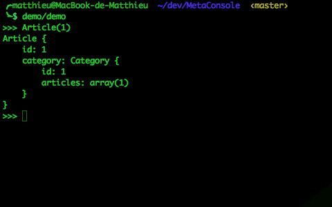

# MetaConsole

MetaConsole is a CLI console that enables you to execute MetaModel expressions.

You can use MetaConsole to debug your app and your data without having to type SQL queries, or to endure the pain of using phpMyAdmin & co.

Work is in progress, and documentation is coming.

[Let me know](https://twitter.com/matthieunapoli) if you are interested by the project :)
